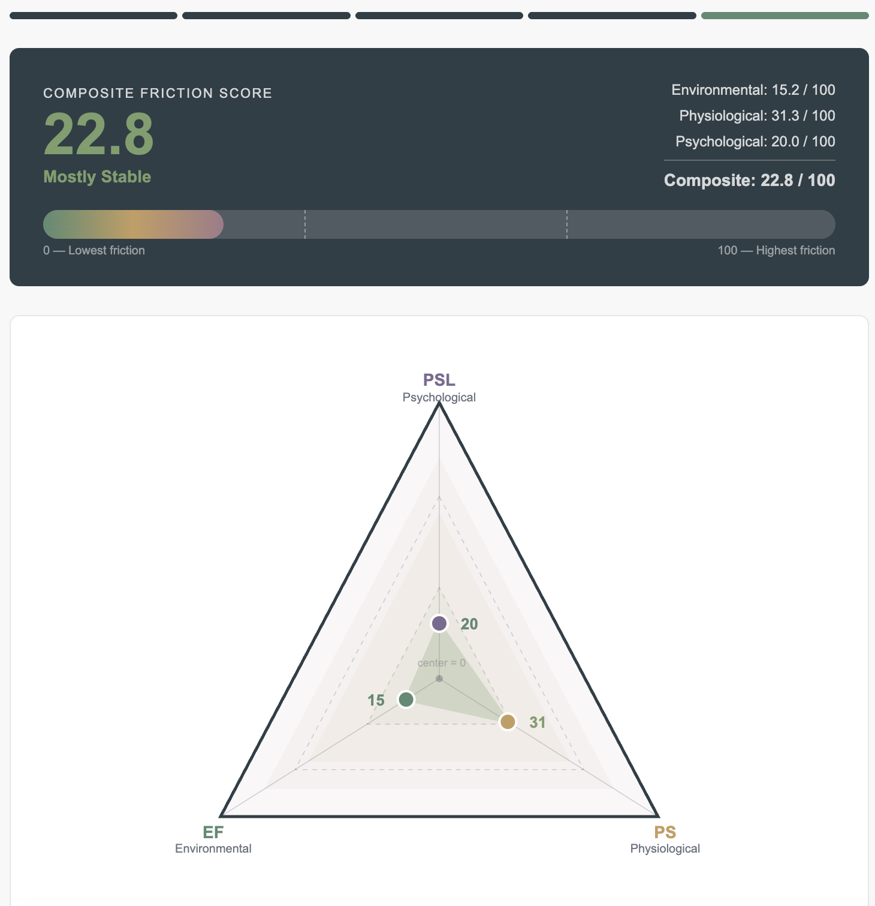

# Dietary Destabilization Triangle (DDT)

**Live demo:**  
https://mhofman11.github.io/ddt/

---

## Core Insight

Very often, diet failures are not caused by lack of nutritional knowledge.

Macros, calories, nutrient timing, and food quality can be modeled with high precision. Yet even well-designed plans frequently fail in practice — not because the plan is wrong, but because the surrounding context cannot reliably support execution.  

This problem is just complex enough to avoid detection in the first place for most dieters (those who need it most), while also being just simple enough to be modeled in a repeatable interactive framework for social consumption

DDT models the constraint structure that determines whether a plan can survive real life.

Instead of optimizing the diet itself, the framework evaluates the friction field the diet must operate inside.  Which is exactly the sort of “transport to context” that unseasoned participants need.

Three dimensions consistently dominate adherence outcomes:

- **Environmental Friction (EF)**  
  Food availability, cost constraints, preparation burden, proximity to viable options, and logistical overhead. The structural gap between theoretical food choices and realistically accessible ones.

- **Physiological Friction (PS)**  
  Hunger volatility, energy instability, sleep disruption, and biological signals that degrade decision stability before conscious choice occurs.

- **Psychological Stress Load (PSL)**  
  Cognitive bandwidth constraints created by time pressure, unpredictability, competing responsibilities, and decision fatigue.

You can map nutrients perfectly and still miss the variables most likely to determine whether consistency is possible.

DDT is the recognition that those variables exist, interact, and often dominate outcomes.

---

## Conceptual Framing

DDT treats context as a first-class variable.

Traditional nutrition tools answer:

> What should this person eat?

DDT attempts to answer:

> What is most likely to destabilize this person's ability to follow through?

This reframes adherence failure from a motivation problem into a constraint-alignment problem.

The triangle is intentionally minimal: not a full behavioral model, but a compression of contextual dimensions most likely to produce failure if ignored.

The working hypothesis is that many real-world optimization problems fail not because the solution is incorrect, but because the context required to execute the solution has not been adequately represented.

DDT is a small demonstration of what happens when contextual structure is made legible.

---

## Product Perspective

A nutritionally perfect plan that is environmentally unrealistic is not a good plan.

A plan that ignores physiological instability will require constant willpower.

A plan that assumes unused cognitive bandwidth will fail silently.

DDT identifies which dimension is acting as the primary constraint so intervention effort can be directed toward reducing friction rather than increasing pressure.

The model is interpretable by humans, structured enough for rule-based systems, and compatible with LLM-assisted reasoning layers.

This makes the output usable by individuals, coaches, or AI systems attempting to generate context-aware guidance.

---

## Technical Implementation

Single-page application built with:

- HTML
- CSS
- Vanilla JavaScript

Core architecture:

- deterministic scoring engine
- multi-axis friction model
- harmonic mean composite scoring
- rule-based archetype classification
- structured interpretation layer
- responsive UI

All scoring logic is transparent and client-side.

---

## Model Structure

Three independent scoring axes (0–100):

- Environmental Friction (EF)
- Physiological Friction (PS)
- Psychological Stress Load (PSL)

Composite friction calculated via harmonic mean of stability scores. This penalizes single-axis failure states, reflecting how one unstable dimension can destabilize the entire behavioral system.

Dominant axis determines intervention archetype.

---

## Why This Exists

Repeated observation from coaching and applied behavior work:

people often fail at systems they fully understand.

The failure mode is rarely informational. It is usually structural.

DDT is an attempt to formalize the contextual forces that shape adherence so they can be reasoned about explicitly instead of discovered through repeated breakdowns.

More broadly, the project explores how compressing high-dimensional context into small, interpretable structures can improve decision quality for both humans and intelligent systems.

---

## Status

MVP functional.

Demonstrates stable scoring behavior across simulated user profiles using Playwright regression tests.

---

## Possible Extensions

- longitudinal friction tracking
- adaptive intervention recommendations
- API exposure for coaching tools
- integration with wearable or behavioral data
- expansion of friction modeling into adjacent domains
- deeper LLM-assisted interpretation layers

---

## Author Perspective

Developed from applied experience in fitness coaching and behavior change.

Motivated by repeated exposure to cases where outcome quality was better predicted by environmental and cognitive constraints than by nutritional sophistication.

DDT represents an attempt to formalize that pattern into a reusable decision-support structure.

